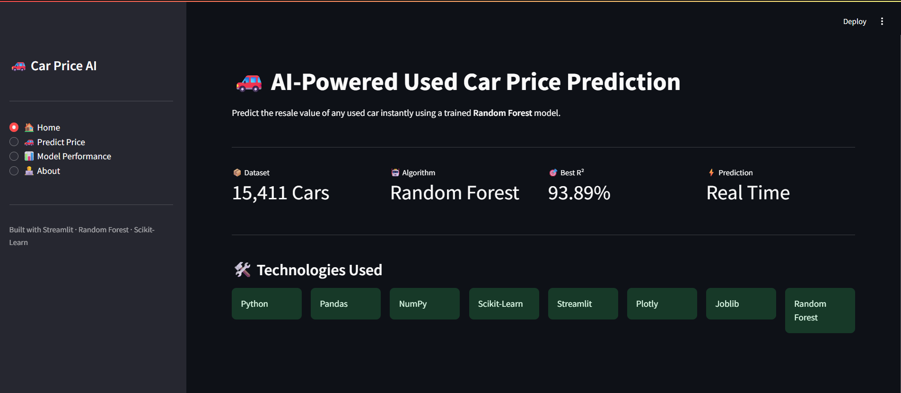
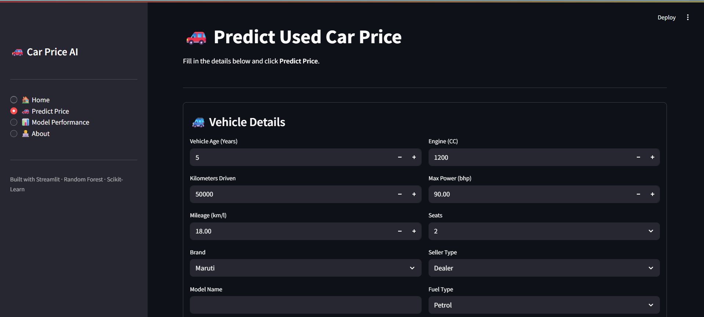
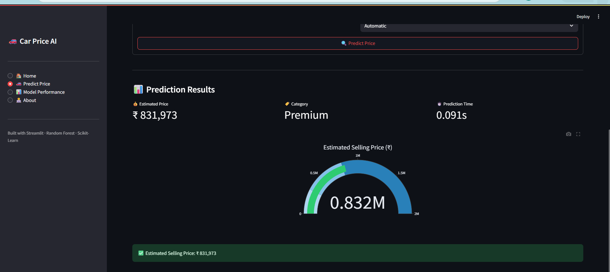
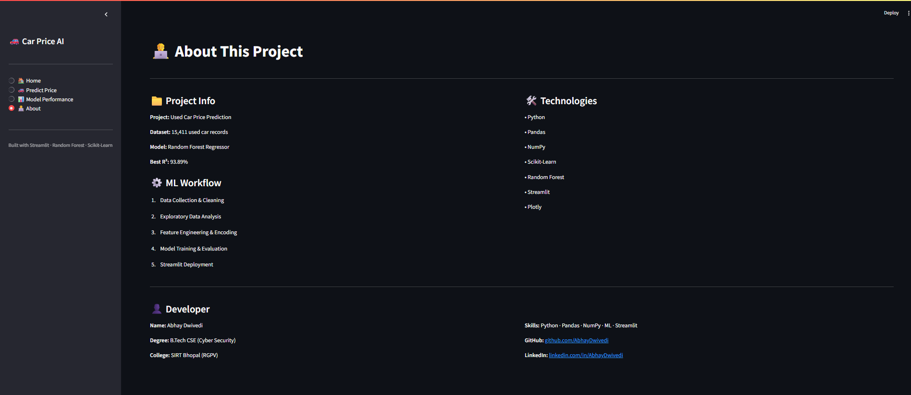

# 🚗 AI-Powered Car Price Prediction

A Machine Learning web application that predicts the selling price of used cars using **Random Forest Regression**. The application is built with **Python** and **Streamlit**, providing a simple and interactive interface for real-time price prediction.

---
# 🚗 AI-Powered Car Price Prediction

### 🌐 Live Demo
https://ai-powered-car-price-prediction-uikbeitr8vufn4ma9scyww.streamlit.app/

## 📌 Project Overview

This project predicts the resale value of used cars based on vehicle specifications such as:

* Brand
* Model
* Vehicle Age
* Kilometers Driven
* Fuel Type
* Seller Type
* Transmission Type
* Engine Capacity
* Max Power
* Mileage
* Number of Seats

The model was trained on a real-world used car dataset and deployed using **Streamlit**.

---

## ✨ Features

* 🚗 Real-time car price prediction
* 📊 Interactive Streamlit dashboard
* 🤖 Machine Learning based prediction
* 📈 Model performance comparison
* 📋 User-friendly interface
* ⚡ Fast prediction using a trained Random Forest model

---

## 🛠️ Technologies Used

* Python
* Pandas
* NumPy
* Scikit-learn
* Streamlit
* Plotly
* Joblib

---

## 🤖 Machine Learning Models

Three regression models were trained and evaluated:

| Model                       | R² Score  |
| --------------------------- | --------- |
| Linear Regression           | 0.800     |
| Decision Tree Regressor     | 0.886     |
| **Random Forest Regressor** | **0.939** |

**Random Forest Regressor** was selected as the final model because it achieved the highest prediction accuracy.

---

## 📊 Model Evaluation

* **R² Score:** 0.939
* **MAE:** Evaluated during model testing
* **MSE:** Evaluated during model testing
* **RMSE:** 214,528

---
### 📁 Project Structure

```text
AI-Powered-Car-Price-Prediction/
│
├── 📁 screenshots/
│   ├── HomePage.png
│   ├── UserInput.png
│   ├── ModelPrediction.png
│   ├── ModelPerformance.png
│   └── About.png
│
├── 🐍 app.py
├── 📊 cardekho_dataset.csv
├── 🤖 car_price_prediction_model.pkl
├── 📦 model_columns.pkl
├── 📋 requirements.txt
├── 📄 README.md
└── 🚫 .gitignore
```
## 📷 Application Screenshots

### 🏠 Home Page

The home page provides an overview of the project, technologies used, and model performance.



---

### 🚗 User Input

Users can enter vehicle details such as brand, model, fuel type, transmission, mileage, engine, and other specifications.



---

### 💰 Price Prediction

The application predicts the estimated selling price using the trained Random Forest Regressor model.



---

### 📊 Model Performance

Comparison of Linear Regression, Decision Tree, and Random Forest models using evaluation metrics such as R² Score and RMSE.


---

### 👨‍💻 About

Information about the project, workflow, technologies used, and developer details.


---

## 🚀 Installation

Clone the repository:

```bash
git clone https://github.com/YOUR_USERNAME/AI-Powered-Car-Price-Prediction.git
```

Go to the project folder:

```bash
cd AI-Powered-Car-Price-Prediction
```

Install the required libraries:

```bash
pip install -r requirements.txt
```

Run the application:

```bash
streamlit run app.py
```

---

## 📷 Application Preview

You can add screenshots of your application here after uploading them to GitHub.

Example:

* Home Page
* Prediction Page
* Model Performance Page

---

## 🎯 Future Improvements

* Add more vehicle features
* Improve prediction accuracy using XGBoost
* Deploy the application on Streamlit Community Cloud
* Add price trend analysis
* Improve UI with additional analytics

---

## 👨‍💻 Developer

**Abhay Dwivedi**

B.Tech – Computer Science & Engineering (Cyber Security)

Sagar Institute of Research & Technology, Bhopal

---

## ⭐ If you found this project useful, consider giving it a Star on GitHub!
